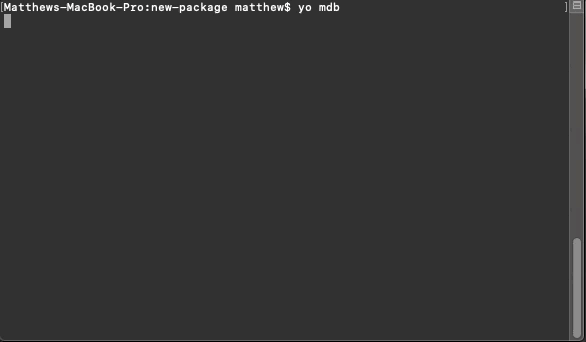

# Matthew Bill Code Generator



## Prerequisites

The Matthew Bill code generator is based on [Yeoman](https://yeoman.io/). The `yo` npm package first needs to be installed globally.

``` bash

npm install yo -g

```

## Install

The generator should be installed at the global level:

``` bash

npm install generator-mdb -g

```

## Running

Run the following command to get a list of all generators and then select the `Mdb` generator:

``` bash

yo

```
or to run the generator directly, run the following command:

``` bash

yo mdb

```
